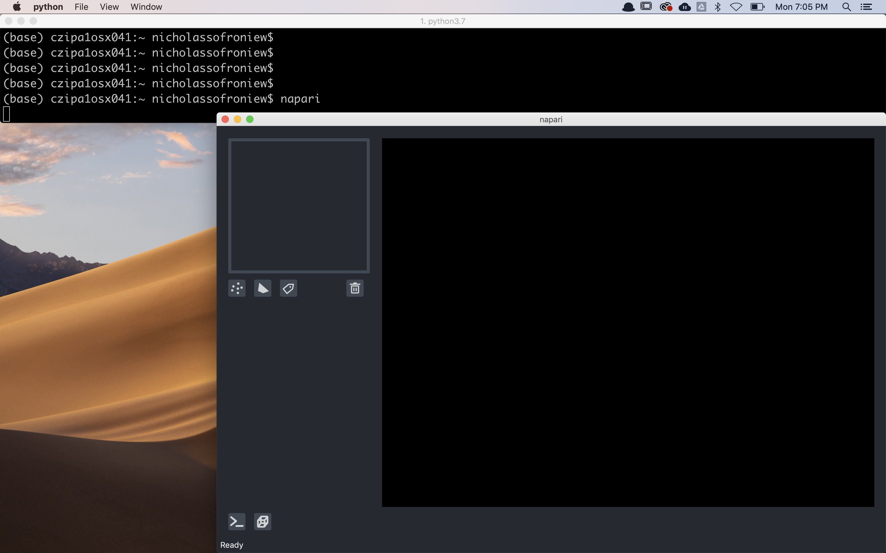
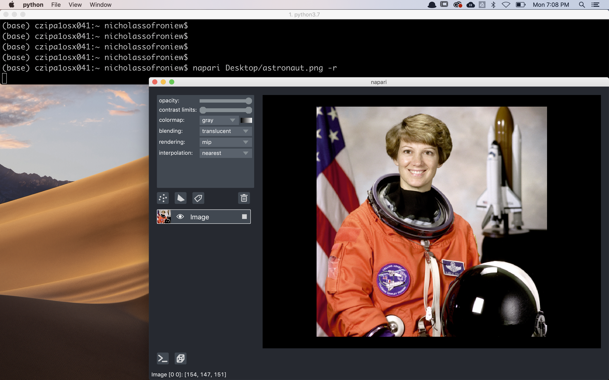
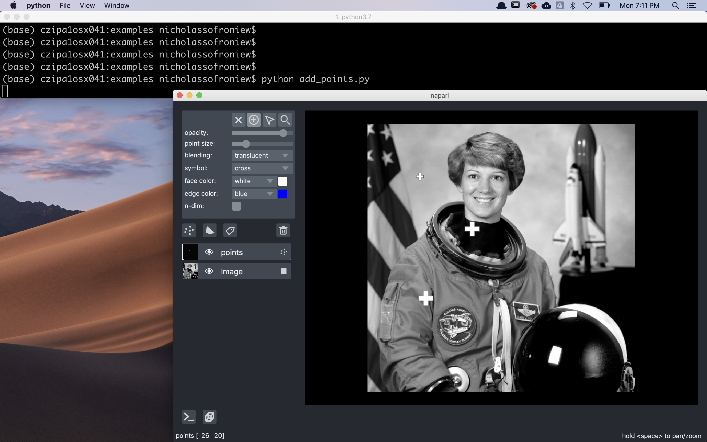
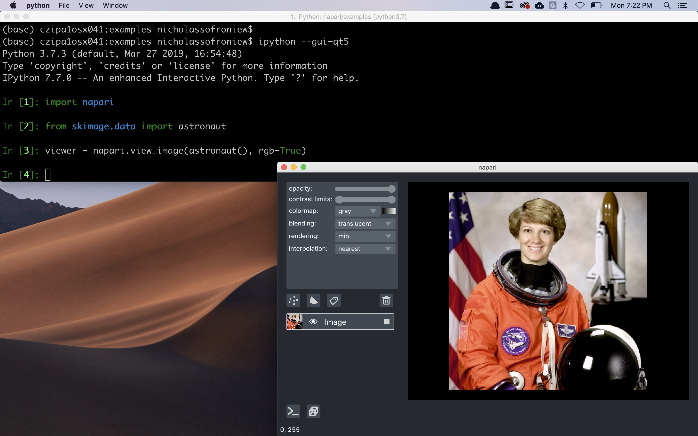
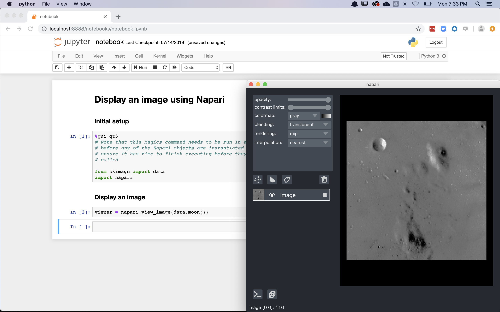

# getting started with napari

Welcome to the getting started with **napari** tutorial!

This tutorial assumes you have already installed napari. For help with installation see our [installation tutorial](installation.md).

This tutorial will teach you all the different ways to launch napari. At the end of the tutorial you should be able to launch napari and see the viewer your favourite way.


## launching napari

There are four ways to launch the **napari** viewer:

- command line
- python script
- IPython console
- jupyter notebook


All four of these methods will launch the same napari viewer, but depending on your use-case different ones may be preferable.

### command line usage

To launch napari from the command line simply run
```sh
napari
```

This command will launch an empty viewer:



Once you have the viewer open you can add images through the `File/Open` dropdown menu or by dragging and dropping images directly on the viewer. We currently only support files that can be read with [`skimage.io.imread`](https://scikit-image.org/docs/dev/api/skimage.io.html#skimage.io.imread), such as `tif`, `png`, and `jpg`. We plan on adding support for more exotic file types shortly - see [issue #379](https://github.com/napari/napari/issues/379) for discussion. You can also create new empty `points`, `shapes`, and `labels` layers using the new layer buttons in the bottom right of the viewer.

You can also directly load an image into the viewer from the command line by passing the path to the image as an argument as follows
```sh
napari my_image.png
```
If the image is `RGB` or `RGBA` use the `-r` or `--rgb` flag.



Launching napari directly from the command line is the simplest and fastest way to open the viewer, but it doesn't allow you to preprocess your images before opening them. It is also currently not possible to save images or other layer types directly from the viewer, but we'll be adding support for this functionality soon as discussed in [#379](https://github.com/napari/napari/issues/379).

### python script usage

To launch napari from a python script, inside your script you should import `napari`, create a Qt GUI context, and then create the `Viewer` by adding some data.

For example to add an image and some points inside your script you should include:

```python
import napari

# create Qt GUI context
with napari.gui_qt():
    # create a Viewer and add an image here
    viewer = napari.view_image(my_image_data)

    # custom code to add data here
    viewer.add_points(my_points_data)
```

then run your script from the command line to launch the viewer with your data:
```sh
python my_example_script.py
```

See the scripts inside the [`examples`](https://github.com/napari/napari/tree/master/examples) in the main repository for examples of using napari this way.



An advantage of launching napari from a python script is that you can preprocess your images and add multiple layers before displaying the viewer.

### IPython console usage

To launch napari from an IPython console, first instantiate a Qt GUI and then import `napari` and create a `Viewer` object.

It is best to launch the viewer with the GUI already set to be Qt by

```
IPython --gui=qt5
```

Then inside IPython
```python
# instantiate Qt GUI
import napari
from skimage.data import astronaut

# create the viewer and display the image
viewer = napari.view_image(astronaut(), rgb=True)
```

If you did not launch IPython with the GUI already then you can set it from within IPython using `%gui qt5`, but be warned that the Qt GUI can take a few seconds to be created and if you create the `Viewer` before it is finished, the kernel will die and the viewer will not launch.



An advantage of launching napari from an IPython console is that the you can continue to programmatically interact with the viewer from the IPython console, including bidirectional communication, where code run in the console will update the current viewer and where data changed in the GUI will be accessible in the console.

### jupyter notebook usage

You can also launch napari from a jupyter notebook, such as [`examples/notebook.ipynb`](https://github.com/napari/napari/tree/master/examples/notebook.ipynb)



As in the case of the IPython console though you must wait for the Qt GUI to instantiate following the `%gui qt5` magic command. Instantiating the Qt GUI can take a few seconds and if you create the `Viewer` before it is finished, the kernel will die and the viewer will not launch. For this reason the `%gui qt5` magic command should always be run in a separate cell from creating the viewer.

Similar to launching from the IPython console, an advantage of launching napari from a jupyter notebook is that you can continue to programmatically interact with the viewer from jupyter notebook, including bidirectional communication, where code run in the notebook will update the current viewer and where data changed in the GUI will be accessible in the notebook.

## next steps

To learn more about how to use the napari viewer the different types of napari layers checkout the [viewer tutorial](viewer.md) and more of our tutorials listed below.

## all tutorials

- [welcome](../README.md)
- [installing napari](installation.md)
- [getting started tutorial](getting_started.md)
- [viewer tutorial](viewer.md)
- [image layer tutorial](image.md)
- [labels layer tutorial](labels.md)
- [points layer tutorial](points.md)
- [shapes layer tutorial](shapes.md)
- [surface layer tutorial](surface.md)
- [vectors layer tutorial](vectors.md)
- [gallery](../gallery/gallery.md)
